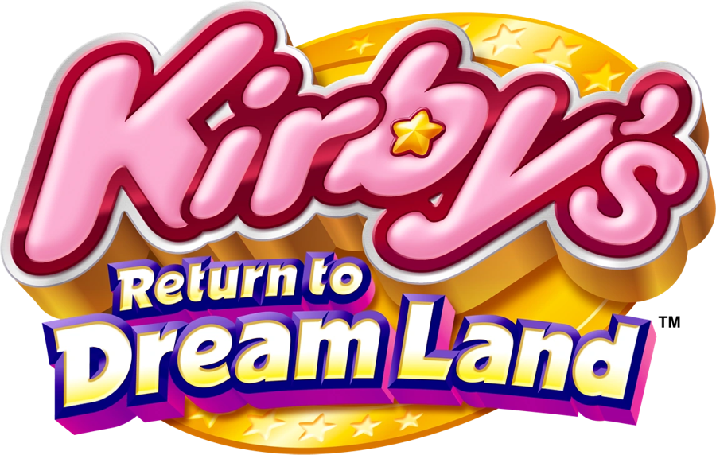

# Kirby Patch

Play **Kirby's Return to Dream Land** (Wii) with **GameCube controllers** — up to
four of them, no Wii Remote needed — or with Classic Controllers in either of
two button styles. Works with the USA (`SUKE01`), European (`SUKP01`, *Kirby's
Adventure Wii*), Japanese (`SUKJ01`, *Hoshi no Kirby Wii*) and Korean (`SUKK01`,
*Byeorui Kirby Wii*) releases.

The patches are applied to your own copy of the game: drop a clean `.wbfs` or
`.iso` onto the patcher and play the result on a Wii (USB loader) or in
Dolphin. Nothing from the game is included in this repository.



## How it works, in one paragraph

The game was written for a Wii Remote held sideways. Vague Rant and crediar's
Classic Controller support rewrites a Classic Controller into exactly that, right
where the Wii's `KPAD` library reads its samples (including the shaking and the
pointer the game asks for). The GameCube patch makes a GameCube controller look
like a Classic Controller to that same code: it drives the console's own
controller polling, writes the pad's state into KPAD as Classic Controller
samples, and tells the game a controller is connected. See
[docs/TECHNICAL.md](docs/TECHNICAL.md) for the details.

## Controls

### GameCube controller (ports 1-4 = players 1-4)

| Input | Action |
| --- | --- |
| Control stick | Move · menus |
| A | Jump · float · confirm |
| B | Inhale · use the copy ability · cancel |
| X | Shake (ability specials) |
| Y | Drop the copy ability |
| L / R | Guard |
| Z | HOME Menu |
| Start | Pause |
| D-pad | D-pad |
| C stick | Pointer (HOME Menu) |

In the HOME Menu the C stick points and **L / R click**. The layout is the same
whichever Classic Controller style you choose.

### Classic Controller

The game has no Classic Controller mode of its own; this is Vague Rant and
crediar's remapping, with the control scheme adapted from the Nintendo Switch
remaster. You choose one of two styles when you patch.

| Classic Controller | B/A style | Y/B style |
| --- | --- | --- |
| Left stick | Move · menus | same |
| D-pad | D-pad | same |
| A | Jump · float · confirm | Drop the copy ability |
| B | Inhale · use the copy ability · cancel | Jump · float · confirm |
| Y | Drop the copy ability | Inhale · use the copy ability · cancel |
| X / L / R | Shake | same |
| ZL / ZR | Guard (the Wii Remote's A) | same |
| − | Drop the copy ability | same |
| + | Pause | same |
| HOME | HOME Menu | same |
| Right stick | Pointer (HOME Menu) | same |

With a Classic Controller on a Wii U (vWii) injection, enable *Force Classic
Controller Connected*.

## Installing

### Patch your disc image

You need a clean `.wbfs` or `.iso` of the game. Download the patcher for your
system from the releases page (or the artifacts of the latest CI run), or run
it from source (needs Python 3 with tkinter and
[Wiimms ISO Tool](https://wit.wiimm.de/) (`wit`) on your `PATH`):

```bash
python3 tools/gui.py
```

Tick the patches you want, choose the Classic Controller button style, then
drop the image onto the window (or click to choose it). The patcher checks the
disc id, patches `sys/main.dol`, rebuilds the image in the same format and
replaces your file, keeping the original next to it as `<name>.bak`. Other
releases, and images already modified by something else, are refused rather
than corrupted. You can run it again later to add the other patch; the button
style of a patched disc cannot be switched, so start again from the `.bak` for
that.

The GameCube controller is read through the Classic Controller code, so ticking
it always installs that too.

Kirby's Return to Dream Land is protected by Metafortress, which crashes the game
if `main.dol` is changed. The patcher switches that protection off first, using
the bypass Vague Rant published.

There is a command-line twin:

```bash
python3 tools/patch_disc.py "Kirby's Return to Dream Land (USA) (En,Fr,Es).wbfs" --gc
python3 tools/patch_disc.py game.wbfs --cc --style yb
```

### Gecko codes (Dolphin)

Copy `codes/<disc id>.ini` (`SUKE01`, `SUKP01`, `SUKJ01` or `SUKK01`) into Dolphin's
`GameSettings` folder and enable the codes under **Properties → Gecko Codes**.
Enable exactly one *Classic Controller* style; the *GameCube controllers* code
of the same style goes with it. Set the GameCube ports to Standard Controllers.
A Wii Remote is optional for the GameCube code.

The same codes are in `codes/<disc id>.txt` in the plain layout loaders read.
(The Gecko codes do not need the Metafortress bypass: they change memory after
the game has started.)

### Riivolution

`riivolution/<disc id>.xml` is a Riivolution patch with a single *Controllers*
option (Classic Controller, or Classic Controller + GameCube, in either style).
It matches on the disc id and version, so it cannot be applied to the wrong
release.

### Which release do I have?

The disc id is the first six characters of the disc (`SUKE01` USA, `SUKP01`
Europe/Australia, `SUKJ01` Japan, `SUKK01` Korea). The GUI and `tools/patch_disc.py` read it for
you.

## Limits

- The GameCube controllers work with **no Wii Remote connected at all**; with
  one connected, its own buttons still work alongside the pad. GameCube port *n*
  drives player *n*.
- A GameCube pad opens the HOME Menu with Z (there is no HOME button); there is
  no rumble.
- A GameCube pad can be plugged in before or after the game starts; it is
  noticed within a moment.
- The Korean release has no published Classic Controller or Metafortress patch:
  its sites were carried over from the other three releases' (see
  [docs/TECHNICAL.md](docs/TECHNICAL.md)) and checked in Dolphin only as far as
  the controls go.
- Nothing here has been run on a console: it has been verified in Dolphin (see
  [docs/TECHNICAL.md](docs/TECHNICAL.md)). The polling of the GameCube ports
  follows [Barrel Blast Patch](https://github.com/quatric/Barrel-Blast-Patch)
  and [City Folk](https://github.com/quatric/ACCF-Patch), which were tested on
  hardware, but ports 2-4 are new here.

## Repository layout

| Path | What |
| --- | --- |
| `src/` | the GameCube hooks (C, devkitPPC), Vague Rant's code, and the per-release builders |
| `tools/` | the patcher, GUI, Gecko / Riivolution generators and the checks |
| `tools/prebuilt/` | the patch data the patcher ships (generated from `src/`) |
| `codes/`, `riivolution/` | generated Gecko code lists and Riivolution patches |
| `docs/TECHNICAL.md` | how the patches work |

Rebuilding the patch data from source needs devkitPPC and your own `main.dol`
dumps; end users need neither:

```bash
KIRBY_DOLS=/path/with/SUKE01.dol,SUKP01.dol,SUKJ01.dol python3 tools/gen_prebuilt.py
python3 tools/build.py
python3 tools/check.py
```

## Credits

- **Vague Rant, crediar** — the Classic Controller support (button remapping,
  shake and pointer emulation, D-pad from the stick) and the Metafortress
  bypass this builds on
- **Barrel Blast Patch, City Folk Patch** — GameCube SI polling and the KPAD
  sample synthesis this follows

## License

MIT, see [LICENSE](LICENSE).
